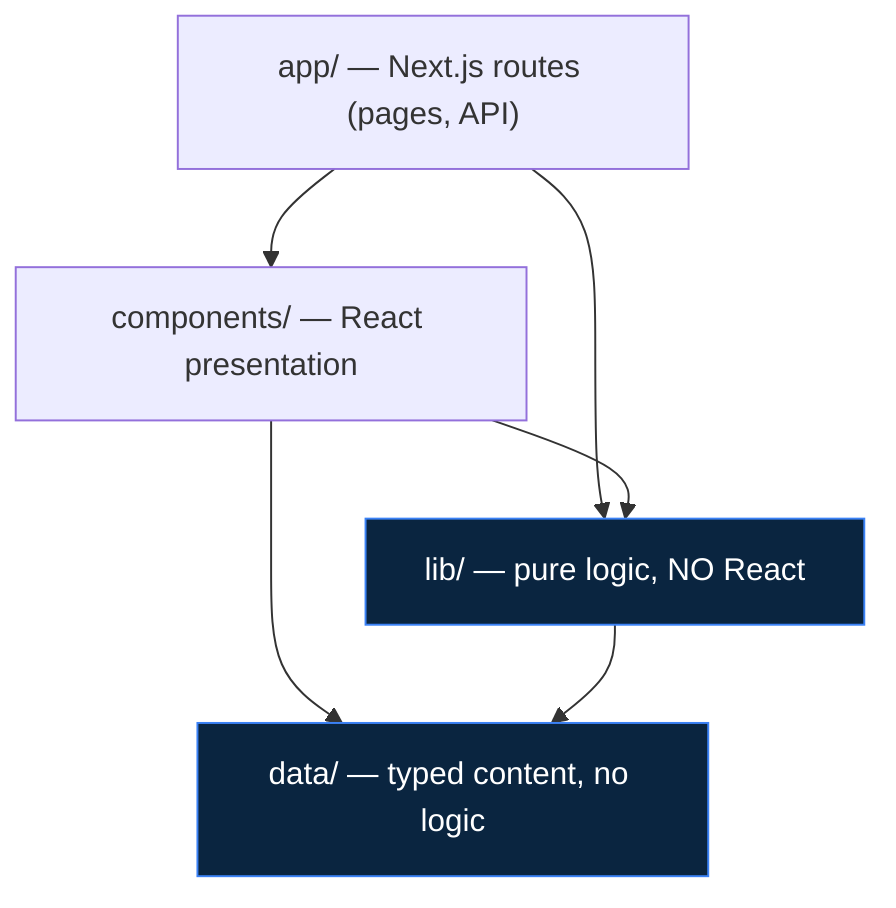

# AlgoLab — Code Walkthrough

A guided tour of the AlgoLab codebase for engineers joining the project. Read top to bottom: it starts with the big picture (layering), then the data model, then traces one feature end to end, and finishes with the practical "how do I add X" and "how do I run the tests" sections.

---

## 1. What AlgoLab is, and how it's layered

AlgoLab is a DSA interview-prep web app: a **question bank**, a **practice tracker**, a **study planner**, and a set of **frame-based algorithm visualizers** with "explain like I'm 5" (ELI5) explanations. It's a Next.js 14 (App Router) app in TypeScript strict mode, styled with Tailwind on a dark navy theme (`#0a0e1a`), animated with Framer Motion, and deployed on Vercel. There is no backend database in v1 — content is typed data files, and user progress lives in `localStorage`.

The one architectural rule that everything else follows: **dependencies flow inward, toward pure logic.**



Concrete consequences of this rule (worth internalizing on day one):

- **`lib/` never imports React.** Every frame generator, the planner, the storage adapter, the execution adapter — all of it is plain TypeScript that can be unit-tested without a DOM. If you reach for a React import inside `lib/`, you're in the wrong layer.
- **`data/` is inert.** Typed records and metadata only. No fetching, no logic.
- **Components are presentation.** They render `lib/` output and call `lib/` functions; they hold no business rules.
- **No component touches `localStorage` directly.** All persistence goes through the `storage` singleton in `lib/storage.ts` (see §4).

---

## 2. Directory map

Annotated tree of the real files (tests and config trimmed for signal):

```
app/                              Next.js App Router routes
├── layout.tsx                    root layout (dark theme, nav)
├── page.tsx                      / — dashboard (streak, breakdown, today's questions)
├── questions/
│   ├── page.tsx                  /questions — filterable bank
│   └── [id]/page.tsx             /questions/[id] — detail + CodePad
├── visualize/
│   ├── page.tsx                  /visualize — gallery (driven by registry.ts)
│   └── [slug]/page.tsx           /visualize/[slug] — one visualizer
├── plan/page.tsx                 /plan — study-planner wizard + calendar
├── patterns/[slug]/page.tsx      /patterns/[slug] — pattern explainer + ELI5
└── api/run/route.ts              POST /api/run — code-execution boundary

lib/                              Pure logic — no React anywhere in here
├── types.ts                      ALL domain types (single source of truth)
├── storage.ts                    StorageAdapter interface + LocalStorageAdapter
├── dashboard.ts                  currentStreak, difficultyBreakdown
├── algorithms/                   one pure frame generator per visualizer
│   ├── binarySearch.ts           binarySearchFrames() + binarySearchCode
│   ├── twoPointers.ts  slidingWindow.ts  monotonicStack.ts  kadane.ts   (array substrate)
│   ├── dfsGrid.ts  bfsGrid.ts                                           (grid substrate)
│   ├── heap.ts  hashTable.ts  bigO.ts                                   (tree/bucket/chart)
│   ├── views.ts                  typed Frame.view payloads for non-array substrates
│   ├── registry.ts               VISUALIZERS catalog (gates gallery + routes)
│   └── *.test.ts                 co-located Vitest for every generator
├── planner/                      study-plan generation (pure)
│   ├── generatePlan.ts           order pool → chunk into weeks
│   ├── spacedRepetition.ts       2/5/10-day resurfacing
│   ├── today.ts                  3–5 daily items (reviews first)
│   ├── rebalance.ts              regenerate future weeks, keep history
│   └── planner.test.ts
└── execution/                    code-execution adapter
    ├── client.ts                 runCode() — browser → /api/run
    ├── wandbox.ts                runCodeOnService() — server → Wandbox API
    └── types.ts                  RunRequest/RunResult + size caps

components/
├── visualizer/                   Stepper engine + shared visualizer UI
│   ├── Stepper.tsx               generic frame player (the core engine)
│   ├── CellRow.tsx CodePanel.tsx StateReadout.tsx Controls.tsx
│   ├── PointerBadge.tsx Eli5Toggle.tsx Eli5Panel.tsx
│   ├── ArrayVisualizer.tsx       config-driven host for array-substrate viz
│   ├── GridVisualizer.tsx GridStage.tsx StackPanel.tsx     (grid)
│   ├── HeapVisualizer.tsx TreeStage.tsx                    (tree)
│   ├── HashTableVisualizer.tsx BucketStage.tsx             (bucket)
│   ├── BigOVisualizer.tsx ChartStage.tsx                   (chart)
│   ├── BinarySearchVisualizer.tsx
│   ├── InputEditor.tsx ArrayInput.tsx
│   └── VisualizerSwitch.tsx      slug → visualizer component
├── questions/
│   ├── CodePad.tsx               line-numbered editor + Run
│   └── QuestionDetail.tsx
└── ui/  Nav.tsx  DifficultyBadge.tsx  ProgressRing.tsx

data/                             Typed content only
├── patterns.ts                   PatternMeta + canonical ELI5 analogies + templates
└── questions/
    ├── index.ts                  aggregates all sections; BY_ID O(1) lookup + helpers
    └── arrays.ts strings.ts ... backtracking.ts   (110 records, 10 sections)
```

The question bank holds **110 records across 10 sections** — 93 fully authored (Python + Java solutions), 17 typed stubs (`stub: true`, detail page shows "coming soon").

---

## 3. The data model — `lib/types.ts`

Everything domain-shaped is declared in one file, `lib/types.ts`. There are no scattered type definitions to chase. Walking the important ones:

### Sections (the spine of the whole app)

```ts
// lib/types.ts
export const SECTIONS = [
  "Arrays", "Strings", "Linked Lists", "Stacks & Queues", "Binary Search",
  "Trees", "Heaps & Priority Queues", "Graphs", "Dynamic Programming", "Backtracking",
] as const;
export type Section = (typeof SECTIONS)[number];
```

This array is **dependency-ordered** and its order is load-bearing: the planner sequences study weeks by section index, and `data/questions/index.ts` assembles the bank in this order. Treat the array order as the source of truth, not a display preference.

### `Question`

```ts
// lib/types.ts
export interface Question {
  id: string;
  title: string;
  section: Section;
  pattern: string;          // pattern slug, keys into PATTERNS
  difficulty: Difficulty;   // "Easy" | "Medium" | "Hard"
  description: string;
  examples: Example[];      // { input, output, explanation? }
  constraints: string[];
  eli5: string;
  hints: [string, string, string];  // exactly 3, progressive
  approach: string;
  solutions: Solutions;     // { python: string; java: string }
  timeComplexity: string;
  spaceComplexity: string;
  companies: string[];
  leetcodeSlug: string;
  stub?: boolean;           // content not yet authored
}
```

Note `hints` is a 3-tuple (the type enforces exactly three), and `solutions` is `{ python, java }` — those are the two `Language` values the coding pad and reference solutions support.

### `Frame` — the visualizer contract

This is the single most important type to understand, because the entire visualizer architecture is built on it:

```ts
// lib/types.ts
export interface Frame {
  highlightLine: number;                     // 1-based line in the code panel
  variables: Record<string, string | number>;
  caption: string;                           // condition under test, with ✓/✗
  eli5Caption: string;                       // plain-language version
  pointers?: Record<string, number>;         // L/M/R/i → cell index (array substrate)
  cellStates?: CellState[];                  // per-cell visual state (array substrate)
  view?: Record<string, unknown>;            // substrate data for non-array viz
}
```

A `Frame` is one step of an animation. The **common fields** (`highlightLine`, `variables`, `caption`, `eli5Caption`) are read by the generic `<Stepper>` for *every* visualizer. `pointers`/`cellStates` carry the array substrate; non-array visualizers (grid, tree, bucket, chart) stash their data in the opaque `view` bag, typed per-substrate in `lib/algorithms/views.ts` (§6). `CellState` is `"default" | "active" | "current" | "visited"` → blue / amber / dimmed.

### `QuestionProgress` — what gets persisted per question

```ts
// lib/types.ts
export interface QuestionProgress {
  questionId: string;
  status: QuestionStatus;          // Not started | Attempted | Solved | Needs review
  grades: GradeEvent[];            // { grade: "Got it"|"Struggled"|"Failed"; at: epochMs }
  scratchpad: Record<string, string>;  // coding-pad drafts keyed by language
  bookmarked: boolean;
  updatedAt: number;               // epoch ms
}
```

The `grades` history is what spaced repetition reads (§8); `scratchpad` is keyed by language so Python and Java drafts coexist.

### `StudyPlan`

```ts
// lib/types.ts
export interface StudyPlan {
  inputs: PlanInputs;   // { weeks, hoursPerWeek, level, targetCompanies }
  weeks: PlanWeek[];    // each { week, questionIds[], sections[] }
  createdAt: number;    // epoch ms — used to compute "current week"
}
```

`createdAt` matters: `today.ts` derives the current week from elapsed time since this timestamp.

### How `data/` is shaped against these types

`data/questions/*.ts` each export a typed array (e.g. `arraysQuestions: Question[]`), and `data/questions/index.ts` stitches them together in section order and builds the lookups:

```ts
// data/questions/index.ts
export const QUESTIONS: Question[] = [...arraysQuestions, ...stringsQuestions, /* … */];
const BY_ID = new Map<string, Question>(QUESTIONS.map((q) => [q.id, q]));  // O(1) lookup
export function getQuestion(id: string) { return BY_ID.get(id); }
export function questionsBySection(section: Section): Question[] { /* filter */ }
export function orderedSections(): Section[] { /* SECTIONS that have questions */ }
export function allCompanies(): string[] { /* distinct, sorted */ }
```

`data/patterns.ts` exports `PATTERNS: Record<string, PatternMeta>` — pattern blurbs, **canonical ELI5 analogies**, emojis, and template code. The analogies here are the single source of truth (two pointers = friends in a hallway, hash table = labeled cubbies, etc.); reuse them, never invent a new one for an existing pattern.

---

## 4. The storage seam — `lib/storage.ts`

**Why it exists.** v1 has no backend, but we don't want `localStorage` calls smeared across components — that would make a future DB/auth layer a global rewrite. So persistence hides behind one interface (Dependency Inversion):

```ts
// lib/storage.ts
export interface StorageAdapter {
  getProgress(questionId: string): QuestionProgress | null;
  getAllProgress(): QuestionProgress[];
  setStatus(questionId: string, status: QuestionStatus): void;
  setScratchpad(questionId: string, language: Language, draft: string): void;
  getScratchpad(questionId: string, language: Language): string;
  toggleBookmark(questionId: string): void;
  addGrade(questionId: string, grade: SelfGrade): void;
  getPlan(): StudyPlan | null;
  setPlan(plan: StudyPlan): void;
  clearPlan(): void;
}

export const storage: StorageAdapter = new LocalStorageAdapter();  // the single instance
```

Components import `storage` and call methods. They never know it's `localStorage`. To swap in a backend, you write a `class ApiStorageAdapter implements StorageAdapter` and change the one `new LocalStorageAdapter()` line — no UI changes.

**SSR-safety.** Next.js renders on the server where there's no `window`. Every method guards on it and returns empty/no-op data so server rendering never throws:

```ts
// lib/storage.ts
private readProgressMap(): Record<string, QuestionProgress> {
  if (typeof window === "undefined") return {};   // server: empty
  try {
    const raw = window.localStorage.getItem(PROGRESS_KEY);
    return raw ? JSON.parse(raw) : {};
  } catch { return {}; }                            // quota / private mode: fail silently
}
```

Because reads return empty on the server, components that depend on stored state hydrate it inside `useEffect` on the client (see `CodePad` in §7). Two keys are used: `algolab:progress` (a map keyed by question id) and `algolab:plan`. There's a small `addGrade` side effect worth knowing — grading `"Got it"` sets status to `Solved`, anything else sets `Needs review`.

---

## 5. End-to-end trace: the Binary Search visualizer

This is the canonical path. Understand this one and you understand all ten visualizers. The flow:

```
user input → binarySearchFrames(arr, target) → Frame[] → <Stepper> → renderStage → <CellRow> + <CodePanel>
```

**Step 1 — Route renders the visualizer.** `/visualize/[slug]/page.tsx` looks up the slug in the registry and hands off to `VisualizerSwitch`, which for `"binary-search"` returns the dedicated `<BinarySearchVisualizer/>`.

**Step 2 — The visualizer component owns the inputs and generates frames.** It holds `arr` and `target` in state, and recomputes frames whenever they change:

```tsx
// components/visualizer/BinarySearchVisualizer.tsx
const { frames } = useMemo(() => binarySearchFrames(arr, target), [arr, target]);
// …
<Stepper
  frames={frames}
  codeLines={binarySearchCode}
  eli5={eli5}
  renderStage={(f) => (
    <CellRow values={arr} cellStates={f.cellStates ?? []} pointers={f.pointers ?? {}} />
  )}
/>
```

Three things are passed to the generic engine: the `frames`, the `codeLines` to display, and a `renderStage` callback that draws the substrate for a given frame. Everything else is the engine's job.

**Step 3 — The pure generator emits frames.** `binarySearchFrames` is plain TS in `lib/algorithms/binarySearch.ts`. Each loop iteration pushes one or more frames; each frame names the code line it maps to and the visual state:

```ts
// lib/algorithms/binarySearch.ts
// Time: O(log n) — window halves each step. Space: O(log n) frames.
export function binarySearchFrames(arr: number[], target: number): BinarySearchResult {
  // …
  while (lo <= hi) {
    const mid = lo + ((hi - lo) >> 1);
    frames.push({
      highlightLine: 3,                                   // → "mid = lo + (hi - lo) // 2"
      pointers: { L: lo, M: mid, R: hi },
      cellStates: windowStates(n, lo, hi, mid),           // visited|active|current
      variables: { lo, hi, mid, "arr[mid]": arr[mid], target },
      caption: `Check the middle: mid=${mid}, arr[mid]=${arr[mid]}.`,
      eli5Caption: `Guess the middle of what's left: ${arr[mid]}.`,
    });
    if (arr[mid] < target) { /* push "discard left" frame */ lo = mid + 1; }
    else if (arr[mid] > target) { /* push "discard right" frame */ hi = mid - 1; }
    // …
  }
}
```

The `codeLines` array (`binarySearchCode`) lives right next to the generator, and the comment on each line documents its 1-based index. **The contract: keep `highlightLine` values in sync with that array.** `windowStates` is a private helper that marks cells outside `[lo, hi]` as `visited` (dimmed), `mid` as `current` (amber), and the rest as `active` (blue).

**Step 4 — The Stepper plays the frames.** `components/visualizer/Stepper.tsx` is the generic engine, reused by every visualizer. It owns playback state and reads only the common frame fields:

```tsx
// components/visualizer/Stepper.tsx
export function Stepper({ frames, codeLines, renderStage, eli5 }: StepperProps) {
  const [idx, setIdx] = useState(0);
  const [playing, setPlaying] = useState(false);
  const [speed, setSpeed] = useState(1);           // steps/sec
  // play/pause loop via setInterval(1000/speed); resets to frame 0 when `frames` changes
  // keyboard: ArrowRight = step fwd, ArrowLeft = step back, Space = play/pause
  const frame = frames[Math.min(idx, lastIndex)];
  return (
    <>
      {renderStage(frame, idx)}                     {/* substrate — the only algo-specific bit */}
      <Controls /* play/pause/step/reset/speed */ />
      <StateReadout frame={frame} eli5={eli5} />    {/* variables + caption (✓/✗) */}
      <CodePanel lines={codeLines} highlightLine={frame.highlightLine} />
    </>
  );
}
```

Crucially, the Stepper has **no algorithm-specific logic**. It doesn't know what binary search is. It plays an array of frames and delegates the picture to `renderStage`.

**Step 5 — Stage + code panel render the active frame.**
- `renderStage` (from step 2) calls `<CellRow>`, which draws the array as 44px rounded cells, colors each by `cellStates[i]` via a `CELL_STYLES` map, and floats `<PointerBadge>`s (L/M/R) above the right cells. Cell movement animates via Framer Motion `layout`.
- `<StateReadout>` shows the live `variables` as pills and the `caption` (or `eli5Caption` when ELI5 is on).
- `<CodePanel>` renders `codeLines` with line numbers and highlights `frame.highlightLine` with an amber left border — that's the "currently-executing line" sync.

So the loop closes: the generator decided *which line is executing* and *how each cell looks*; the Stepper advances `idx`; the stage + code panel paint frame `idx`. The synced code panel shows **Python**.

---

## 6. How to add a new visualizer

The architecture is designed so a new visualizer is a generator + a thin config, never a bespoke animation loop. Steps:

1. **Write the pure generator** in `lib/algorithms/<algo>.ts`. Export the frame function (returns `{ frames, … }`) and the `<algo>Code` lines array. No React. State the time/space complexity in a doc comment. Add `lib/algorithms/<algo>.test.ts` asserting frame shape, `highlightLine` values, and key transitions.

2. **Register it** in `lib/algorithms/registry.ts` — add a `VisualizerMeta` to the `VISUALIZERS` array with `slug`, `title`, `tagline`, `complexity`, `patternSlug`, and `implemented: true`. This single entry gates both the `/visualize` gallery and the `/visualize/[slug]` route.

3. **Wire the slug to a component** in `components/visualizer/VisualizerSwitch.tsx`:
   - **If it's array-substrate**, you don't write a new component — just add a `<ArrayVisualizer>` config:
     ```tsx
     // components/visualizer/VisualizerSwitch.tsx
     case "my-algo":
       return (
         <ArrayVisualizer
           patternSlug="my-pattern"
           codeLines={myAlgoCode}
           defaultArray={[…]}
           param={{ label: "k", value: 3 }}   // optional scalar input
           generate={(a, p) => myAlgoFrames(a, p ?? 0).frames}
           renderExtra={(f) => <StackPanel items={…} />}  // optional aux panel
         />
       );
     ```
     `ArrayVisualizer` already handles the editable input, ELI5 toggle/panel, `useMemo` regeneration, and renders `<CellRow>` for you.

4. **If it's a non-array substrate**, do two extra things:
   - **Add a typed view payload** in `lib/algorithms/views.ts` (e.g. `GridView`, `TreeView`, `BucketView`, `ChartView`). Your generator casts `frame.view` to this shape. `views.ts` is pure TS so both `lib/` generators and `components/` stages import it without crossing the layering boundary.
   - **Write or reuse a stage component** (`GridStage`, `TreeStage`, `BucketStage`, `ChartStage`) and a host component (`GridVisualizer`, `HeapVisualizer`, …) that reads `frame.view`, then return that host from `VisualizerSwitch`.

The 10 implemented visualizers map to substrates like this:

| Substrate | Visualizers | Stage / view |
|---|---|---|
| Array (`CellRow`) | binary-search, two-pointers, sliding-window, monotonic-stack, kadane | `cellStates` + `pointers` |
| Grid | dfs, bfs | `GridStage` + `StackPanel`/queue, `GridView` |
| Tree (SVG) | heap | `TreeStage`, `TreeView` |
| Bucket | hash-table | `BucketStage`, `BucketView` |
| Chart | big-o | `ChartStage`, `ChartView` |

---

## 7. The coding pad and execution path

The coding pad (`components/questions/CodePad.tsx`) is a line-numbered editor on each question detail page: Python/Java tabs, per-language autosaved drafts, tab-to-indent, and a Run button.

- **Drafts** hydrate from `storage.getScratchpad(questionId, lang)` inside `useEffect` (client-only, because storage returns empty on the server) and fall back to a language starter stub. Every keystroke calls `storage.setScratchpad(...)` — persistence again only through the seam.
- **Tab** inserts 4 spaces and restores the caret; the line-number gutter scroll-syncs to the textarea.

**Execution flow** (browser → API route → external service):

```
CodePad.run() → runCode(req)         lib/execution/client.ts   (browser)
              → POST /api/run        app/api/run/route.ts       (Next server)
              → runCodeOnService()   lib/execution/wandbox.ts   (server → Wandbox)
```

1. `runCode` (`lib/execution/client.ts`) POSTs `{ language, source, stdin? }` to `/api/run` and normalizes failures into a `RunResult` (`{ stdout, stderr, exitCode, ok, error? }`). The browser depends only on this client — never on the execution service directly.

2. **The boundary validates strictly before doing anything** (`app/api/run/route.ts`, fail-fast):
   ```ts
   // app/api/run/route.ts
   if (!LANGUAGES.includes(language)) return bad("Language must be one of: …");   // allowlist
   if (typeof source !== "string" || source.trim() === "") return bad("Source code is required.");
   if (byteLength(source) > MAX_SOURCE_BYTES) return bad("Source code is too large.");   // 50 KB
   if (stdin !== undefined && byteLength(stdin) > MAX_STDIN_BYTES) return bad("…oversized stdin."); // 10 KB
   ```
   Security notes worth flagging: the language is checked against the `LANGUAGES` allowlist (no arbitrary compiler names reach the service), source/stdin sizes are byte-capped (`MAX_SOURCE_BYTES` / `MAX_STDIN_BYTES` from `execution/types.ts`) to blunt runaway input, and the route always returns **200** — compile errors and non-zero exits are normal *results* carried in the body, not HTTP errors.

3. `runCodeOnService` (`lib/execution/wandbox.ts`) calls the **keyless Wandbox public API** (no secret to store; runs server-side only). Two details to know:
   - It **retries once** on a transient sandbox error (matched by a `Resource temporarily unavailable | OCI runtime` regex) after a short delay.
   - It **strips a top-level `public`** from Java (`public class Main` → `class Main`) because Wandbox compiles the file as `prog.java`, which can't match a `public class Main` filename.
   - Compiler ids are resolved from Wandbox's `list.json` (cached, with known-good fallbacks like `cpython-3.14.0` / `openjdk-jdk-22+36`).

   The adapter is intentionally swappable — there's a note that the project moved off Piston when its public API went whitelist-only; replacing Wandbox means rewriting only this one file.

---

## 8. The planner pipeline

All planner logic is pure (`lib/planner/`), takes `now` (epoch ms) as a parameter for deterministic tests, and persists via `storage.getPlan/setPlan`. Four stages:

**Generate — `generatePlan.ts`** — `O(n log n)`, dominated by the sort.
```ts
// lib/planner/generatePlan.ts
orderedPool(questions)   // drop stubs; sort by SECTION index, then Easy→Medium→Hard
questionsPerWeek(inputs) // round(hoursPerWeek × QUESTIONS_PER_HOUR[level]), min 1
chunkIntoWeeks(pool, perWeek, weeks)  // slice into weekly buckets; pad empty weeks
```
It orders the pool by section dependency, front-loads Easy within each section, computes a weekly capacity from hours × level (`Beginner 0.75`, `Intermediate 1`, `Advanced 1.5` questions/hour), and slices the pool into week buckets.

**Today — `today.ts`** — `O(n)` over progress + the current week's ids.
```ts
// lib/planner/today.ts
todaysQuestions(plan, allProgress, now, max = 5): string[]
// 1) due spaced-repetition reviews first (dueReviewIds), then
// 2) this week's still-unsolved questions, deduped, capped at max (3–5/day)
```
The "current week" is derived from `now - plan.createdAt` in week-sized chunks, clamped to the plan length.

**Spaced repetition — `spacedRepetition.ts`** — `O(g)` per question over its grade history; `O(n)` to scan all progress.
```ts
// lib/planner/spacedRepetition.ts
reviewIntervalDays(poorCount)  // 1→2 days, 2→5 days, 3+→10 days
nextReviewDate(progress)       // last grade "Got it" → null (mastered, drops out)
dueReviewIds(allProgress, now) // ids due now, soonest-overdue first
```
A question graded **Struggled/Failed** resurfaces after **2, then 5, then 10 days**; a later **Got it** clears it from rotation.

**Rebalance — `rebalance.ts`** — `O(n log n)`.
```ts
// lib/planner/rebalance.ts
rebalancePlan(plan, allProgress, questions, now): StudyPlan
// keep past weeks verbatim; regenerate week `current`..end from
// still-unsolved, not-yet-locked questions; renumber to follow past weeks.
```
History is never lost — past weeks are preserved, and `inputs`/`createdAt` carry over (actual progress/grades live in `storage`, untouched). It just re-plans the future from where you actually are.

Dashboard stats live next door in `lib/dashboard.ts`: `currentStreak(allProgress, now)` (consecutive days with activity, ending today/yesterday) and `difficultyBreakdown(solvedIds, questions)` (solved counts per difficulty).

---

## 9. Testing and how to run things

**Stack.** Vitest + jsdom. Unit tests are **co-located** next to the code they cover (`lib/algorithms/*.test.ts`, `lib/planner/planner.test.ts`, `lib/dashboard.test.ts`). Current state: **91 tests across 12 files**, and `next build` / `next lint` are clean.

**What's tested.** Every frame generator (frame shape, `highlightLine` correctness, key transitions, found/not-found), the planner (ordering, weekly chunking, today's-list priority, rebalance preserves history), spaced repetition (the 2/5/10 schedule, mastery dropout), and dashboard stats. Because all of `lib/` is pure and takes `now` as a parameter, these tests need no DOM, no clock mocking, and no network.

**Commands** (`package.json`):

```bash
npm run dev          # local dev server
npm run build        # next build — must pass with zero errors before a commit is "done"
npm run lint         # next lint — must be clean
npm run test         # vitest run (one-shot)
npm run test:watch   # vitest watch mode
```

**The bar for "done":** `next build` clean, `next lint` clean, every new frame generator and planner change ships with unit tests, Lighthouse performance > 90, keyboard-accessible, responsive down to ~380px.

---

### TL;DR mental model for a new engineer

- **Logic is pure and lives in `lib/`** (no React). Content is typed and lives in `data/`. UI in `components/` and `app/` consumes both.
- **Visualizers = a pure `Frame[]` generator + the generic `<Stepper>` + a `renderStage`.** Adding one = generator + registry entry + a `VisualizerSwitch` config (plus a view type + stage if it's non-array).
- **All persistence goes through `storage` (`StorageAdapter`).** Swapping `localStorage` for a backend is a one-line change.
- **Execution is gated behind a validated API boundary** (`/api/run`) and a swappable Wandbox adapter.
- **The planner is four pure functions** — generate, today, spaced-repetition, rebalance — all deterministic via an injected `now`.
