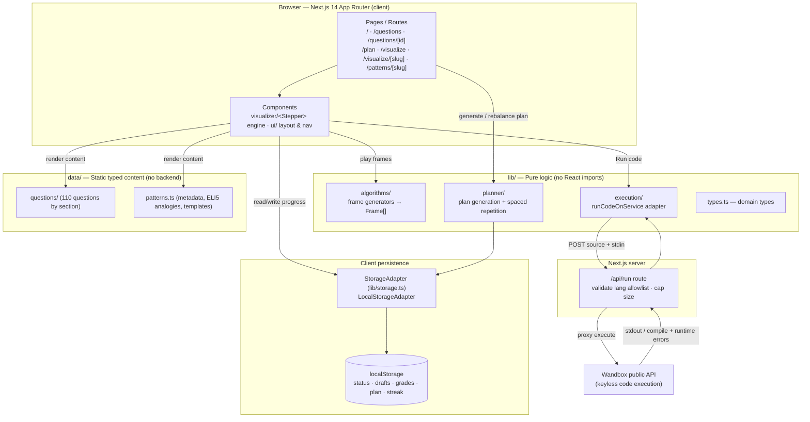
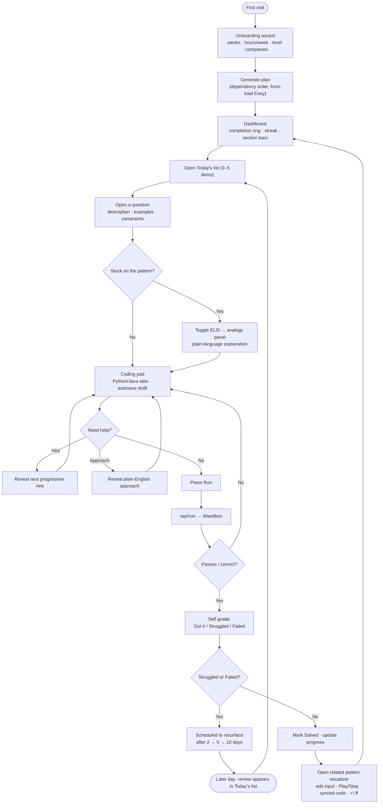

# Product Requirements Document — AlgoLab

| | |
|---|---|
| **Product** | AlgoLab |
| **Version** | v1 (Pass 1) |
| **Status** | Draft for review |
| **Last updated** | 2026-06-13 |

---

## 1. Overview

### Problem statement
Engineers preparing for coding interviews juggle several disconnected tools: a question list (e.g., a spreadsheet or LeetCode), a separate editor to write code, scattered notes or flashcards for spaced repetition, and YouTube/blog posts to understand *why* an algorithm works. Nothing ties the *plan* (what to study and when) to the *practice* (solving and grading yourself) to the *understanding* (seeing the algorithm actually run). Beginners in particular bounce off raw problem statements because the underlying pattern is never made intuitive.

### Vision
AlgoLab is a single, self-contained web app that combines a curated **question bank**, a **practice tracker**, a **study planner** with spaced repetition, and **interactive, frame-based algorithm visualizers** — all with an **ELI5 (explain-like-I'm-5)** layer that makes each pattern intuitive before the code appears. A learner can be onboarded, handed a week-by-week plan, and walked from "I don't get this pattern" to "I solved it and graded myself" without ever leaving the app or creating an account.

### What makes it different
- **Pattern-first, not problem-first.** Questions are grouped by the ~10 reusable patterns that interviews actually test, each with a shared canonical analogy.
- **See the algorithm run.** Ten frame-based visualizers play an algorithm step-by-step with a synced code panel and a live ✓/✗ state readout.
- **A plan that adapts.** A planner sequences questions in dependency order and resurfaces the ones you struggled with via spaced repetition.
- **Zero friction.** No login, no setup, no secrets — progress lives in the browser.

---

## 2. Goals & Non-Goals

### Goals
- G1. Provide 110 curated, interview-representative questions across 10 sections, each fully fleshed out (description, examples, hints, approach, Python + Java solutions, complexity, company tags).
- G2. Let a user practice end-to-end: read → reveal hints/approach/solution on demand → write & **run** code in-app → self-grade.
- G3. Generate a personalized, dependency-ordered study plan with a daily "today" list and spaced-repetition reviews.
- G4. Teach intuition through 10 interactive visualizers plus an ELI5 layer shared across the app.
- G5. Ship a fast, responsive, keyboard-accessible, dark-themed app deployable to Vercel with no backend data store.

### Non-Goals (v1)
- N1. User accounts, authentication, or multi-device sync.
- N2. A content CMS or any authoring UI — content is static, typed source files.
- N3. Social features (sharing, comments, leaderboards, discussion).
- N4. Per-question visualizers (visualizers are per-*pattern*, not per-problem).
- N5. A persistent server-side database of any kind.

### Success metrics
| Metric | Target |
|---|---|
| Plan completion | ≥ 40% of users who generate a plan complete ≥ 1 full week |
| Practice depth | Median ≥ 15 questions reaching "Solved" or "Attempted" per active user |
| Visualizer engagement | ≥ 50% of question-detail sessions also open the related visualizer |
| Run feature reliability | ≥ 98% of code-run requests return a result (success or compile/runtime error) without app error |
| Lighthouse performance | > 90 on key routes |
| Retention proxy | ≥ 3 distinct active days within first 2 weeks (streak ≥ 3) |

---

## 3. Target Users & Personas

**Primary audience:** candidates preparing for software-engineering coding interviews (beginner → advanced) and self-learners studying data structures & algorithms.

### Persona A — "Priya, the Career Switcher" (Beginner)
- Bootcamp grad, ~6 weeks to first interviews, weak on DS&A fundamentals.
- **Needs:** a clear plan ("what do I do today?"), intuition before code, gentle hints rather than instant solutions.
- **Pains:** overwhelmed by problem volume; doesn't know which pattern a problem belongs to.
- **AlgoLab value:** the wizard + Today's list remove decision fatigue; ELI5 + visualizers build intuition; progressive hints prevent solution-peeking.

### Persona B — "Marcus, the Working Engineer" (Intermediate)
- Employed SWE, ~10 weeks out, studying nights/weekends, targeting specific companies.
- **Needs:** company-tagged filtering, efficient review of weak areas, a record of what he's graded "Struggled/Failed."
- **Pains:** limited, irregular study time; forgets patterns he learned weeks ago.
- **AlgoLab value:** company filters, spaced-repetition resurfacing, rebalanceable plan, per-section progress bars.

### Persona C — "Dana, the CS Student / Refresher" (Advanced)
- Final-year CS student or senior engineer refreshing for a level-up loop.
- **Needs:** fast access to a specific pattern's visualizer and a complexity reference; doesn't need a full plan.
- **Pains:** existing tools bury the visual/intuition layer; wants to drill, not be hand-held.
- **AlgoLab value:** direct visualizer routes, editable inputs, Big-O visualizer, browse-by-pattern without committing to a plan.

---

## 4. User Stories / Use Cases

### 4.1 Question Bank
- As a learner, I can browse 110 questions grouped by section and pattern so I can study by topic.
- As a learner, I can filter by section, pattern, difficulty, status, and company, and search by text, so I can find relevant problems fast.
- As a learner, I can open a question and read its description, examples, and constraints.
- As a learner, I can see Python and Java reference solutions with complexity so I can compare my approach.

### 4.2 Practice Experience
- As a learner, I can set a question's status (Not started / Attempted / Solved / Needs review) and bookmark it.
- As a learner, I can reveal hints one at a time, then the plain-English approach, then the full solution, so I don't spoil myself prematurely.
- As a learner, I can write code in a line-numbered pad with Python/Java tabs, and my draft autosaves per language.
- As a learner, I can press **Run** to execute my code and see stdout/errors without leaving the page.
- As a learner, I can self-grade (Got it / Struggled / Failed) so the planner can schedule reviews.

### 4.3 Study Planner
- As a learner, I can complete an onboarding wizard (weeks until interview, hours/week, level, target companies) to generate a week-by-week plan.
- As a learner, I see a daily "Today's questions" list of 3–5 items that includes spaced-repetition reviews.
- As a learner, I can "Rebalance my plan" to regenerate remaining weeks from my current progress without losing history.
- As a learner, I can view a dashboard (overall completion ring, streak, per-section bars, difficulty breakdown).

### 4.4 Visualizers & ELI5
- As a learner, I can open a visualizer, edit the input, and play/pause/step/reset the animation with keyboard controls.
- As a learner, I can watch a synced code panel highlight the executing line and read a live ✓/✗ state readout.
- As a learner, I can toggle ELI5 mode anywhere it's offered to see analogy panels and plain-language captions.

---

## 5. Functional Requirements

### FR-1 Question Bank
- FR-1.1 The bank SHALL contain 110 questions across 10 sections: Arrays, Strings, Linked Lists, Stacks & Queues, Binary Search, Trees, Heaps & Priority Queues, Graphs, Dynamic Programming, Backtracking.
- FR-1.2 Sections SHALL be presented in dependency order and each question SHALL be tagged with exactly one pattern within its section.
- FR-1.3 Each question record SHALL include: `id`, `title`, `section`, `pattern`, `difficulty` (Easy/Medium/Hard), `description`, `examples[]`, `constraints[]`, `eli5`, three progressive `hints[]`, `approach`, `solutions` (Python + Java, commented), `timeComplexity`, `spaceComplexity`, `companies[]`, `leetcodeSlug`.
- FR-1.4 The list view SHALL support filtering by section, pattern, difficulty, status, and company, plus free-text search; filters SHALL be combinable.
- FR-1.5 Each question SHALL link out to its LeetCode page.

### FR-2 Practice Experience
- FR-2.1 The system SHALL persist per-question status (Not started / Attempted / Solved / Needs review) and a bookmark flag.
- FR-2.2 Hints SHALL reveal one at a time (progressive); approach and full solution SHALL be reveal-on-demand and hidden by default.
- FR-2.3 The coding pad SHALL be line-numbered with Python and Java tabs, tab-to-indent, and SHALL autosave a separate draft per language to local storage.
- FR-2.4 The **Run** button SHALL submit the current draft to the execution route and display stdout and compile/runtime errors inline.
- FR-2.5 The system SHALL record a self-grade (Got it / Struggled / Failed) and a grade history with timestamps, feeding the spaced-repetition scheduler.

### FR-3 Study Planner
- FR-3.1 The onboarding wizard SHALL collect: weeks until interview (or target date), hours/week, level (Beginner/Intermediate/Advanced), and target companies.
- FR-3.2 Plan generation SHALL allocate questions per week in section-dependency order, front-loading Easy difficulty.
- FR-3.3 The daily "Today's questions" list SHALL surface 3–5 items, including due spaced-repetition reviews.
- FR-3.4 Questions graded Struggled/Failed SHALL resurface after 2, then 5, then 10 days.
- FR-3.5 "Rebalance my plan" SHALL regenerate only the remaining weeks from current progress, preserving status and grade history.
- FR-3.6 The dashboard SHALL show overall completion ring, current streak, per-section progress bars, and difficulty breakdown.

### FR-4 Visualizers
- FR-4.1 The system SHALL provide 10 frame-based visualizers: binary search, two pointers, sliding window, monotonic stack, Kadane's, DFS, BFS, heap, hash table, Big-O.
- FR-4.2 Each visualizer SHALL be driven by a pure frame-generator function in `lib/algorithms/` returning `Frame[]`; no visualizer SHALL implement its own animation loop.
- FR-4.3 Each visualizer SHALL accept editable, validated input (e.g., array + target).
- FR-4.4 The generic `<Stepper>` SHALL own Play/Pause/Step-forward/Step-back/Reset, a speed slider, and keyboard controls (←/→ step, space play/pause).
- FR-4.5 A synced code panel SHALL highlight the currently executing line per the active frame.
- FR-4.6 A live state readout SHALL display variable values and the condition under test with explicit ✓/✗.

### FR-5 ELI5 Mode
- FR-5.1 A global ELI5 toggle SHALL be available on every pattern page and every visualizer.
- FR-5.2 When ELI5 is on, the analogy panel SHALL appear before any code and frame captions SHALL switch to `eli5Caption`.
- FR-5.3 Canonical analogies SHALL be defined once and reused across the app (no per-page reinvention).

### FR-6 Persistence
- FR-6.1 All user progress (status, bookmarks, drafts, grades, plan, streak) SHALL be read/written exclusively through the `StorageAdapter` interface in `lib/storage.ts`.
- FR-6.2 Components SHALL NOT call `localStorage` directly.

---

## 6. Non-Functional Requirements

- NFR-1 **Performance.** Lighthouse performance > 90 on key routes; visualizers SHALL exhibit no layout shift during animation.
- NFR-2 **Responsiveness.** Fully responsive down to ~380px width; touch-friendly controls; mobile-first.
- NFR-3 **Accessibility.** Keyboard accessible throughout (including visualizer controls); proper labels/roles.
- NFR-4 **Theme.** Dark theme by default (navy background ~#0a0e1a) per the visual design rules.
- NFR-5 **Privacy / data residency.** All user data stays in the browser (localStorage); no accounts, no PII collected, no analytics that transmit personal data. The only outbound call is the user-initiated code Run.
- NFR-6 **Reliability of Run.** The `/api/run` route SHALL validate language against an allowlist and cap source/stdin size before calling Wandbox; failures SHALL surface as inline errors, never as app crashes.
- NFR-7 **Testability.** Pure logic — every frame generator and the planner/spaced-repetition logic — SHALL be unit-tested.
- NFR-8 **Build quality.** `next build` and `lint` SHALL pass clean before any commit is considered done.

---

## 7. System Design / Architecture

AlgoLab is a client-heavy Next.js app. The browser renders pages and components; user state lives in `localStorage` behind a swappable `StorageAdapter`; content and domain logic are static, typed modules with no backend. The single server route, `/api/run`, validates input and proxies code execution to the keyless **Wandbox** public API.

**Layer responsibilities**
- **Presentation (client):** routes + components; the generic `<Stepper>` plays frames and owns all playback/keyboard controls.
- **Pure logic (`lib/`):** frame generators, planner/spaced-repetition, and the execution adapter — React-free and unit-testable.
- **Content (`data/`):** static, typed question and pattern data; the v1 "database."
- **Persistence:** all reads/writes funnel through `StorageAdapter` so a real DB/auth layer can drop in later.
- **Server:** only `/api/run`, which hardens and proxies execution to Wandbox.

---

## 8. Primary User Flow

A representative end-to-end journey for Priya (beginner): onboard → generate a plan → open today's question → learn the pattern (ELI5) → code & Run → self-grade → get the question resurfaced later → visualize the pattern.

---

## 9. Release Scope & Roadmap

### v1 ships (Pass 1)
- Question Bank: 110 questions across 10 sections, full records, combinable filters + search.
- Practice: status + bookmark, progressive hints / approach / solution reveal, line-numbered Python/Java pad with autosaved drafts, **Run** via `/api/run` → Wandbox, self-grade with history.
- Planner: onboarding wizard, week-by-week dependency-ordered plan, daily Today's list, spaced repetition (2/5/10 days), Rebalance, dashboard (ring/streak/section bars/difficulty).
- Visualizers: all 10 frame-based visualizers with `<Stepper>`, editable input, synced code panel, live ✓/✗ readout, keyboard controls.
- ELI5 mode across pattern pages and visualizers with shared canonical analogies.
- Dark theme, responsive to ~380px, keyboard accessible, Lighthouse > 90, unit-tested pure logic, deployed on Vercel.

### Future / roadmap (Pass 2+)
- **Content depth:** more questions per pattern; additional sections (tries, union-find, bit manipulation, intervals); more company tags.
- **Accounts & sync:** optional auth + a real persistence backend swapped behind `StorageAdapter` for multi-device sync.
- **Authoring:** a lightweight content pipeline/CMS for non-engineers to add questions.
- **Richer practice:** test-case runner with expected-output checks; timing/mock-interview mode.
- **More visualizers:** additional patterns; potential per-question visual walkthroughs.
- **Social (optional):** sharable plans, progress export, study groups.
- **Self-hosted execution:** swap Wandbox for a self-hosted runner behind `lib/execution/`.

---

## 10. Open Questions & Risks

| # | Item | Type | Notes / mitigation |
|---|---|---|---|
| 1 | Wandbox availability/latency | Risk | External keyless API; outages or rate limits degrade Run. Surface inline errors; isolate behind `lib/execution/` for easy swap; consider a fallback runner in Pass 2. |
| 2 | localStorage limits / data loss | Risk | Quota (~5–10MB) and clearing browser data loses all progress. Keep payloads small; add export/import as a future safeguard. |
| 3 | No multi-device sync in v1 | Risk | A user switching devices starts over. Documented non-goal; mitigated by accounts in Pass 2. |
| 4 | Java rewrite edge cases | Risk | Auto-rewriting `public class Main` → `class Main` may misfire on unusual sources. Cover with execution-adapter tests. |
| 5 | Solution correctness | Risk | 110 hand-curated solutions could contain errors. Establish a review/test pass on reference solutions. |
| 6 | Plan algorithm satisfaction | Open question | Does dependency-order + Easy-front-loading match how users actually want to study, or do some prefer company-weighted ordering? Validate with early users. |
| 7 | Spaced-repetition intervals | Open question | Are 2/5/10 days the right cadence vs. a tunable SM-2-style schedule? Revisit after usage data. |
| 8 | Visualizer input validation scope | Open question | How large/complex an input should editable visualizers accept before frame counts hurt performance? Define caps per visualizer. |
| 9 | Code execution abuse | Risk | `/api/run` proxies arbitrary user code to a third party. Enforce language allowlist + size caps (in scope); consider rate limiting per IP in Pass 2. |
