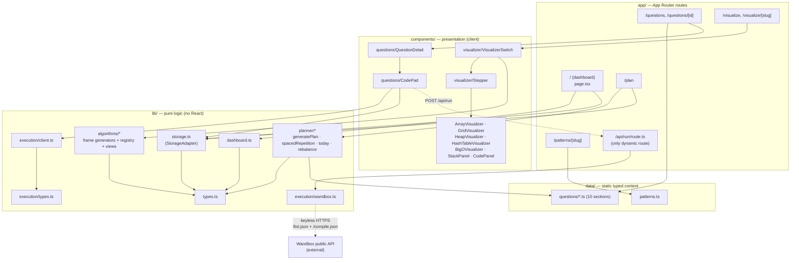
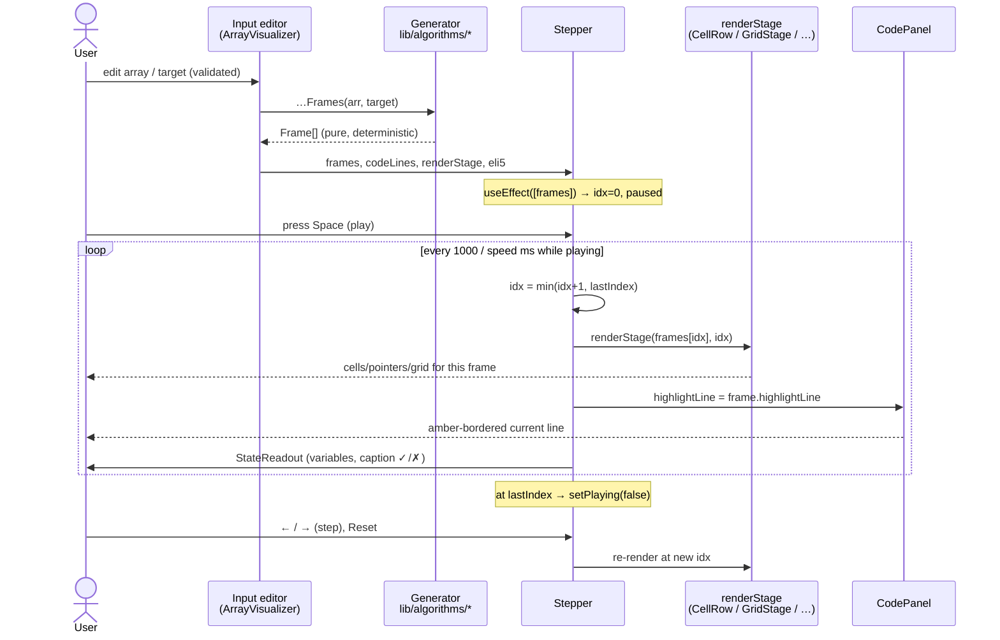
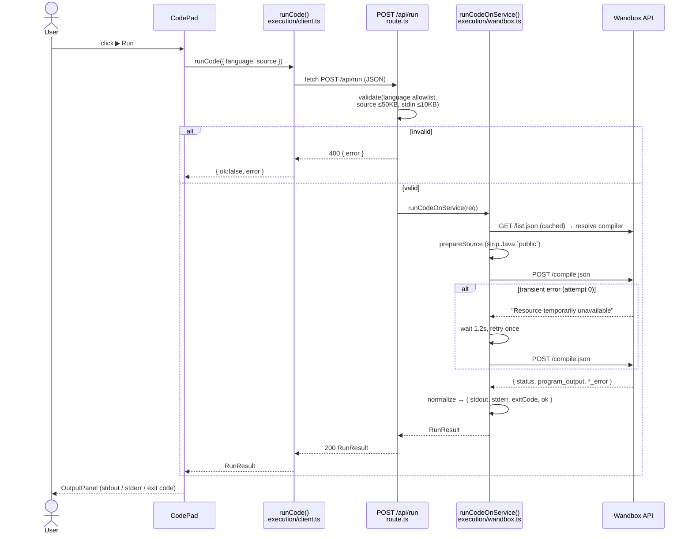

# AlgoLab — Technical Design Document

> Status: v1 · Last updated: 2026-06-13

AlgoLab is a DSA interview-prep web app: a typed question bank, a practice
tracker, a study planner with spaced repetition, and frame-based algorithm
visualizers with ELI5 explanations. It runs on Next.js 14 (App Router) and
deploys to Vercel.

---

## 1. Overview & Goals

### Goals

- **Learn-by-seeing.** Every core pattern (binary search, two pointers, sliding
  window, hashing, DFS/BFS, monotonic stack, heap, Kadane's, Big-O) has an
  interactive, step-through visualizer with a synced code panel and an ELI5
  mode.
- **Practice in place.** Each question ships a runnable coding pad (Python /
  Java) backed by a real execution service.
- **Plan and stick to it.** A study planner sequences questions by section
  dependency and resurfaces weak ones via spaced repetition.
- **Zero backend in v1.** All content is static, typed TypeScript; the only
  server endpoint is `/api/run`. Progress lives in `localStorage` behind a
  swappable interface.

### Non-goals (v1)

- No accounts/auth, no database, no multi-device sync.
- No CMS — content is authored as code under `/data`.
- No per-question bespoke animations — visualizers are per *pattern*.

### Key design principles

| Principle | Where it shows up |
|---|---|
| **Separation of concerns** | `data/` (content) · `lib/` (pure logic, no React) · `components/` (presentation) · `app/` (routes). |
| **Dependency inversion** | UI depends on the `StorageAdapter` interface (`lib/storage.ts`), never on `localStorage` directly. |
| **Open/Closed** | The generic `<Stepper>` is closed; new visualizers extend it by injecting a `renderStage` prop — no edits to the engine. |
| **Pure-function core** | Frame generators (`lib/algorithms/`) and the planner (`lib/planner/`) are pure, deterministic, and fully unit-testable. No React, no I/O, no clock reads (callers pass `now`). |
| **Fail fast at the boundary** | `/api/run` validates language, source size, and stdin size before touching the execution service. |

---

## 2. Architecture / Component Diagram

Dependencies flow **inward**: `app/` and `components/` depend on `lib/` and
`data/`; nothing in `lib/` imports React or reaches back out to components.



---

## 3. Module Breakdown

### `data/` — static content
Typed question records grouped by section (`data/questions/arrays.ts`,
`strings.ts`, … `backtracking.ts`, aggregated in `index.ts`) and pattern
metadata + canonical ELI5 analogies (`data/patterns.ts`). No backend; this is
the source of truth for content in v1.

### `lib/types.ts` — domain model
All shared types. No React, no side effects. The `SECTIONS` array is the
**source of truth for dependency ordering** the planner relies on.

### `lib/storage.ts` — persistence seam
`StorageAdapter` interface + an SSR-safe `LocalStorageAdapter`. The single
exported `storage` instance is the only thing the UI touches for persistence.

### `lib/algorithms/` — visualizer core
- One pure frame generator per algorithm (`binarySearch.ts`, `twoPointers.ts`,
  `slidingWindow.ts`, `monotonicStack.ts`, `kadane.ts`, `dfsGrid.ts`,
  `bfsGrid.ts`, `heap.ts`, `hashTable.ts`, `bigO.ts`). Each exports a
  `…Code` array (1-indexed source lines) and a `…Frames()` generator returning
  `Frame[]`.
- `registry.ts` — `VISUALIZERS` catalog (`VisualizerMeta` with an
  `implemented` flag) + `getVisualizer(slug)` lookup (`Map`, O(1)). Drives the
  gallery and gates per-slug pages. 10 visualizers implemented.
- `views.ts` — typed `Frame.view` payloads for non-array substrates:
  `GridView`, `TreeView`, `BucketView`, `ChartView`, `AuxList`. Pure TS so both
  generators and stage components import it without crossing the layer boundary.

### `lib/planner/` — study planning (pure)
`generatePlan.ts`, `spacedRepetition.ts`, `today.ts`, `rebalance.ts`. All
deterministic; callers pass `now` (epoch ms).

### `lib/dashboard.ts` — derived stats
`currentStreak` and `difficultyBreakdown` computed from raw progress.

### `lib/execution/` — code execution
`types.ts` (`RunRequest`/`RunResult` contract + byte caps), `client.ts`
(browser caller → `POST /api/run`), `wandbox.ts` (server-side adapter to the
Wandbox public API).

### `components/visualizer/` — presentation
Generic `Stepper` (play/pause/step/reset/speed/keyboard), `CodePanel`,
`StateReadout`, `Controls`, and the substrate components: config-driven
`ArrayVisualizer` (+ `CellRow`), `GridVisualizer`/`GridStage`,
`HeapVisualizer`/`TreeStage`, `HashTableVisualizer`/`BucketStage`,
`BigOVisualizer`/`ChartStage`, `StackPanel`. `VisualizerSwitch` maps slug →
component.

### `components/questions/`
`CodePad` (line-numbered editor, per-language autosaved drafts, Run button) and
`QuestionDetail` (problem statement, hints, approach, solutions).

### `app/` — routes
`/` dashboard, `/questions`, `/questions/[id]`, `/plan`, `/visualize`,
`/visualize/[slug]`, `/patterns/[slug]`, and `/api/run` (the only dynamic
route; `runtime = "nodejs"`).

---

## 4. Data Model

Concise view of the load-bearing types in `lib/types.ts`.

```ts
SECTIONS = [Arrays, Strings, Linked Lists, Stacks & Queues, Binary Search,
            Trees, Heaps & Priority Queues, Graphs, Dynamic Programming,
            Backtracking]            // order IS the dependency order

Difficulty = "Easy" | "Medium" | "Hard"
Language   = "python" | "java"

Question {
  id, title, section, pattern, difficulty, description,
  examples[], constraints[], eli5, hints[3], approach,
  solutions: { python, java }, timeComplexity, spaceComplexity,
  companies[], leetcodeSlug, stub?
}

QuestionProgress {            // persisted
  questionId, status: "Not started" | "Attempted" | "Solved" | "Needs review",
  grades: { grade: "Got it" | "Struggled" | "Failed", at }[],
  scratchpad: Record<Language, string>,   // legacy string form tolerated
  bookmarked, updatedAt
}

Frame {                       // produced by generators, played by Stepper
  highlightLine, variables, caption, eli5Caption,
  pointers?, cellStates?,     // array substrate
  view?                       // typed GridView/TreeView/BucketView/ChartView
}

PlanInputs  { weeks, hoursPerWeek, level, targetCompanies }
PlanWeek    { week, questionIds[], sections[] }
StudyPlan   { inputs, weeks[], createdAt }
```

`Frame` is intentionally split: `Stepper` reads only the **common** fields
(`highlightLine`, `variables`, `caption`, `eli5Caption`); substrate-specific
data rides in `pointers`/`cellStates` (arrays) or the typed `view` object.

---

## 5. Visualizer Engine

### Design

Every visualizer is **frame-based** and obeys one convention:

1. A **pure generator** in `lib/algorithms/<algo>.ts` takes input (array /
   grid / target / k) and returns `Frame[]`. No React, no animation loop.
2. The generic **`<Stepper>`** plays the frames. It owns *all* playback
   mechanics: `idx` state, the `setInterval` loop (`1000 / speed` ms),
   play/pause/step-forward/step-back/reset, the speed slider, keyboard controls
   (`←`/`→` step, space play/pause), and resetting to frame 0 when the frame
   array identity changes (new input).
3. The **only** algorithm-specific piece passed to `Stepper` is
   `renderStage(frame, index)` — the visual substrate. This is the Open/Closed
   seam: adding a visualizer never edits `Stepper`.

`Stepper` deliberately reads only the common `Frame` fields plus drives
`CodePanel` (highlights `frame.highlightLine`) and `StateReadout`
(`frame.variables` + caption with explicit ✓/✗). It never inspects `pointers`,
`cellStates`, or `view` — those belong to the injected stage.

Array-substrate algorithms reuse a config-driven `ArrayVisualizer` (+ `CellRow`)
and only differ by their generator, code lines, default input, and an optional
`renderExtra` (e.g. the monotonic-stack `StackPanel`). Non-array algorithms
carry their substrate in the typed `Frame.view` payloads from `views.ts`
(`GridView` → `GridStage`, `TreeView` → `TreeStage`, `BucketView` →
`BucketStage`, `ChartView` → `ChartStage`).

### Plugging in a new visualizer

1. Write a pure generator + `…Code` lines in `lib/algorithms/`, with co-located
   Vitest tests. State its time/space complexity in the docstring.
2. If non-array, define (or reuse) a typed view shape in `views.ts` and a stage
   component.
3. Add a `VisualizerMeta` entry to `registry.ts` and flip `implemented: true`.
4. Wire the slug → component mapping in `VisualizerSwitch.tsx` (a thin
   `ArrayVisualizer`/`GridVisualizer` config, or a dedicated component).

### Sequence — frame playback



---

## 6. Code-Execution Subsystem

### Flow

`CodePad` (browser) → `runCode()` (`lib/execution/client.ts`) →
`POST /api/run` (`app/api/run/route.ts`) → `runCodeOnService()`
(`lib/execution/wandbox.ts`) → **Wandbox public API**. The result
(`{ stdout, stderr, exitCode, ok, error? }`) is rendered in `CodePad`'s output
panel.

### Security & validation (boundary = `/api/run`)

- **Language allowlist.** Must be in `LANGUAGES` (`python` | `java`); anything
  else → 400.
- **Size caps.** `source ≤ MAX_SOURCE_BYTES (~50 KB)`, `stdin ≤
  MAX_STDIN_BYTES (~10 KB)`, measured in real UTF-8 bytes — guards against
  runaway payloads / abuse.
- **Empty/malformed input** → 400 with a clear message; non-JSON body → 400.
- **No source logging.** The route never logs user source — avoids leaking
  pasted credentials/PII.
- **Server-only execution.** `wandbox.ts` runs only inside the Node route
  handler, never in the browser. The Wandbox API is **keyless**, so there is no
  secret to store or leak.
- **Outcome vs. failure.** Execution outcomes (compile errors, non-zero exit)
  return **200** with details in the body; only request-level failures
  (validation, network) return 400 / `error`.

### Adapter specifics (`wandbox.ts`)

- **Compiler resolution.** Fetches `/list.json` once (cached promise), prefers
  the hardcoded fallback if Wandbox still offers it, else the first matching
  `cpython-3*` / `openjdk-jdk-*`. Falls back to `FALLBACK_COMPILER` on any
  failure.
- **One retry.** Retries a single time, after a 1.2 s delay, on transient
  sandbox errors (`Resource temporarily unavailable` / `OCI runtime`).
- **Java fixup.** Wandbox compiles `prog.java`, so a top-level `public class`
  can't match the filename — the adapter strips the leading `public ` so the
  standard `public class Main { … }` stub compiles.
- **Timeouts.** 20 s `AbortSignal.timeout` on both Wandbox calls.

### Sequence — Run



---

## 7. Persistence Design

`lib/storage.ts` defines `StorageAdapter` and ships one implementation,
`LocalStorageAdapter`, exposed via the single `storage` instance.

- **Single seam (Dependency Inversion).** Components depend on the interface,
  never on `localStorage`. Swapping in a DB/auth-backed adapter later means
  implementing the same interface and changing one export — no UI churn.
- **Keys.** `algolab:progress` (a `Record<id, QuestionProgress>`) and
  `algolab:plan` (`StudyPlan`).
- **SSR-safe.** Every access guards `typeof window === "undefined"` and returns
  empty data on the server, so Next.js renders without a DOM. Reads/writes are
  wrapped in `try/catch` to tolerate quota errors / private mode.
- **Backward compatibility.** Legacy progress where `scratchpad` was a single
  string is tolerated (`drafts()` coerces to `{}`), so the move to per-language
  drafts never breaks existing users.
- **Mutation pattern.** `mutate()` reads the map, applies a callback, stamps
  `updatedAt`, and writes back — keeping all writes consistent.

**Swap path to a DB:** implement `StorageAdapter` against an API client
(async), introduce `Promise`-returning variants or a thin async wrapper, gate
behind auth, and point the exported `storage` at the new adapter. Domain types
(`QuestionProgress`, `StudyPlan`) already model exactly what a row would store.

---

## 8. Planner Algorithms

All in `lib/planner/`, pure and deterministic (`now` is injected).

| Function | What it does | Time | Space |
|---|---|---|---|
| `orderedPool` | Drops `stub` questions; sorts by section-dependency index, then `Easy→Medium→Hard`. | O(n log n) | O(n) |
| `questionsPerWeek` | `round(hoursPerWeek × QUESTIONS_PER_HOUR[level])`, min 1. Beginner 0.75 / Intermediate 1 / Advanced 1.5. | O(1) | O(1) |
| `chunkIntoWeeks` | Slices the ordered pool into weekly buckets; pads trailing weeks empty so the calendar spans the full range. | O(n) | O(n) |
| `generatePlan` | `orderedPool` → `chunkIntoWeeks`. Dominated by the sort. | O(n log n) | O(n) |
| `reviewIntervalDays` | Poor-grade count → 2 / 5 / 10 days. | O(1) | O(1) |
| `nextReviewDate` | `null` if never graded or last grade `Got it`; else `last.at + interval(poorCount)`. | O(g) over a question's grades | O(1) |
| `isDueForReview` / `dueReviewIds` | Filter due, soonest-overdue first. | O(n log n) (sort) | O(n) |
| `currentWeekNumber` | Elapsed-time week index, clamped to plan length. | O(1) | O(1) |
| `todaysQuestions` | Reviews-first, then current-week unsolved; deduped, capped at 3–5. | O(n) | O(n) |
| `rebalancePlan` | Preserve past weeks verbatim; regenerate current-onward from unsolved (minus locked past), renumber. History (in storage) untouched. | O(n log n) | O(n) |

Dashboard (`lib/dashboard.ts`): `difficultyBreakdown` O(n); `currentStreak`
O(n + d) building a day-set then walking backward from today/yesterday.

---

## 9. Testing Strategy

Co-located Vitest unit tests (jsdom) cover the pure core: **91 tests across 12
files** — every frame generator, the full planner (`generatePlan`,
`spacedRepetition`, `today`, `rebalance`), and `dashboard`. `next build` and
`next lint` are clean.

### Mapping to the pyramid

```
        ▲  E2E              — deferred in v1
       ▲▲  Integration       — /api/run boundary (manual / smoke)
      ▲▲▲  Unit (broad)       — generators, planner, spaced-rep, dashboard ✅
```

- **Unit (the foundation).** The frame generators and planner are pure and
  deterministic (input → `Frame[]` / plan; `now` injected), which makes them
  ideal unit targets — fast, no I/O, no flakiness.
- **Component / page.** Stage components and pages are verified via
  headless-browser smoke checks, **not** unit-tested in v1 (deferred).
- **E2E.** Not yet automated. Primary journeys to cover later: open a
  visualizer and step through; run code in `CodePad`; generate and rebalance a
  plan.

### Covered vs. deferred

| Area | v1 |
|---|---|
| Frame generators | Unit-tested ✅ |
| Planner + spaced repetition | Unit-tested ✅ |
| Dashboard stats | Unit-tested ✅ |
| `/api/run` validation, `wandbox` adapter | Not unit-tested — **gap** to close |
| `storage` adapter (SSR guards, legacy coercion) | Not unit-tested — **gap** |
| Stage components / pages | Headless smoke only |
| E2E journeys | Deferred |

---

## 10. Deployment & Performance

- **Vercel.** Static content + client components prerender well; `/api/run` is
  the only dynamic route (`runtime = "nodejs"`) and **requires outbound
  network** to reach Wandbox. No environment secrets needed (keyless API).
- **Performance.**
  - Frames are precomputed once per input; the `Stepper` loop only advances an
    index and re-renders the current frame — O(1) per tick.
  - `registry.ts` uses a `Map` for O(1) slug lookup.
  - Visualizer pages are slug-routed and can be statically generated; only the
    coding pad triggers a network call (on Run).
  - Targets from the project bar: Lighthouse perf > 90, keyboard accessible,
    responsive down to ~380px, dark navy (`#0a0e1a`) theme, no layout shift
    during animation.
- **Execution latency.** Wandbox calls carry a 20 s timeout and a single
  transient-error retry (1.2 s backoff); the UI shows a "Running…" state and
  surfaces a friendly error on network/timeout.

---

## 11. Key Design Decisions & Trade-offs

### Per-pattern, not per-question, visualizers
Visualizers illustrate the *pattern* (binary search, sliding window, …), not
each individual problem. **Trade-off:** less bespoke per question, but a small,
maintainable set of generators + the reusable `Stepper`/stage substrate covers
the whole bank. Adding a visualizer is a generator + a registry flag, not a new
animation.

### Wandbox vs. Piston vs. self-hosted
Originally targeted **Piston**, but its public API became whitelist-only
(Feb 2026). Switched to **Wandbox** (keyless public API). Because execution
lives behind the swappable `lib/execution/wandbox.ts` adapter and the
`RunRequest`/`RunResult` contract, the migration touched one file. **Trade-off:**
dependence on a free public service (rate/availability risk, transient sandbox
errors) vs. the cost/ops of self-hosting a sandbox. Mitigated with timeouts,
one retry, and the adapter seam (self-hosting later is a drop-in swap).

### localStorage now, DB later
`localStorage` behind `StorageAdapter` ships v1 with zero backend.
**Trade-off:** single-device, no sync, clearable by the user — accepted for v1.
The interface + already-DB-shaped domain types make the auth/DB swap a contained
change.

### Static typed content vs. CMS
Content is TypeScript under `/data`. **Trade-off:** authoring requires a code
change/deploy and there's no non-engineer editing path, but we get type safety,
PR review, zero infra, and trivial static rendering.

### Future work
- Unit-test the `/api/run` validator, the `wandbox` adapter, and the `storage`
  adapter (SSR guards + legacy coercion) — current gaps.
- Add Playwright E2E for the three primary journeys.
- Auth + DB-backed `StorageAdapter` for cross-device sync.
- Self-hosted execution sandbox if Wandbox availability becomes a problem.
- Visualizer input editors for grid/tree/heap substrates (parity with array
  inputs).
```
